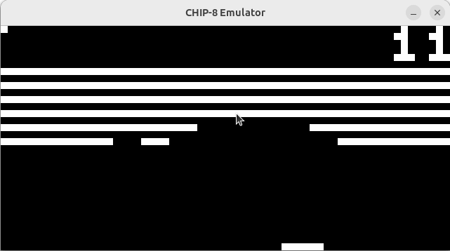

# 🤖 CHIP-8 Emulator

## 🌟 Overview

Welcome to my CHIP-8 Emulator project! This is a project to emulate the classic CHIP-8 environment using modern C++20. The reasons for building this simulator are to go deeper into CPU architectures, to implement first-hand a cycle-by-cycle simulator and to have fun!

With this emulator, you can run vintage CHIP-8 games and programs. 

## ✨ Features

- 🚀 Full implementation of the CHIP-8 instruction set.
- 🛠️ Modular design for easy maintenance and extension.

## 📋 Prerequisites

- **CMake** (version 3.0 or higher) 📦
- **Clang** (or another C++20-compatible compiler; if using a different compiler, you may need to adjust the `CMakeLists.txt` file) 🛠️
- **SDL2** library 📺 (for rendering graphics and handling input).

## ⚙️ Building and running the project

### 🚀 Release Build
From the source of the project:
```bash
mkdir build
cd build
cmake ..
make 
```

### 🐛 Debug Build
From the source of the project:
```bash
mkdir build
cd build
cmake .. -DCMAKE_BUILD_TYPE=Debug
make 
```
### ▶️ Running the Emulator
1. Place your <name>.ch8 ROM file in the rom folder. Just one, the emulator will load the first that it founds.

2. The emulator automatically searches for and loads the first .ch8 binary in the folder.

3. Run the emulator executable generated in the bin folder:
```bash
./emu 
```
> Note: An example .ch8 hex game is included to test the emulator. Just build the project and try it out! In this case is a classic brick breaker game, you can see an actual execution in the GIF below. 



**And this is the key mapping:**


## 🤝 Contributing

Contributions are welcome! Feel free to open issues or submit pull requests.

## 📄 License

This project is licensed under the MIT License. Check out the LICENSE file for more details.

## 🙏 Acknowledgements
[Tobias V. Langhoff's Chip-8 Technical Reference](https://tobiasvl.github.io/blog/write-a-chip-8-emulator/#annn-set-index) - An awesome guide to the CHIP-8 architecture.
